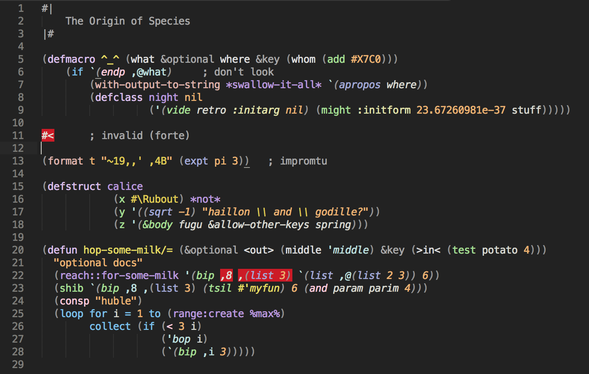

A theme for Lisp development in Sublime Text 3.

It builds upon [Coal Graal by Bastien Dejean](https://github.com/baskerville/Coal-Graal.tmTheme)

Designed to be used with [xurxodiz's Lisp package](http://github.com/xurxodiz/Lisp) (and syntax scoping).

Here's what `demo.lisp` looks like:

